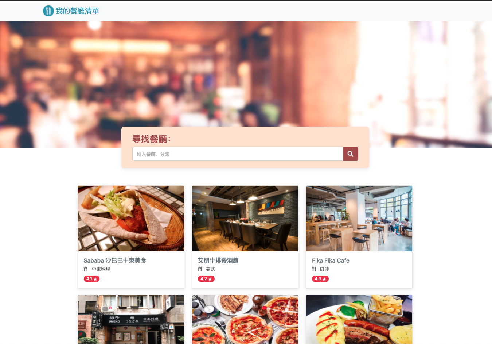

## My Restaurant List
A simple website with list of gourmet restaurant built with Node.js and Express

## Features 
* Listing restaurants from restaurant api
* Restaurant names, photos, category and ratings
* Restaurant location and contact details with description of restaurant features
* Search restaurant by name in both Chinese and English, also by category.



## Getting Started
**Clone respository**
```
$ git clone https://github.com/jilltu330/restaurant-list.git
```
**Install by npm**
```
$ npm install
```
**Execute**
```
$ npm run dev
```
**Browse the website on localhost**
```
http://localhost:3000/
```

## Built With
* Node.js (v10.15.0)
* Express (v4.17.1)
* Express-Handlebars (v5.3.2)
* Bootstrap (v4.3.1)


